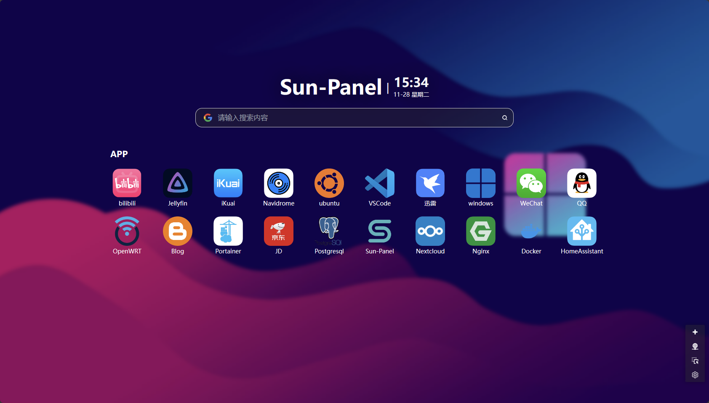
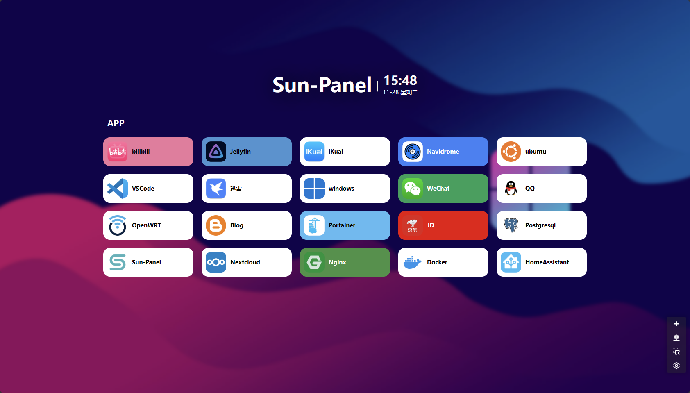
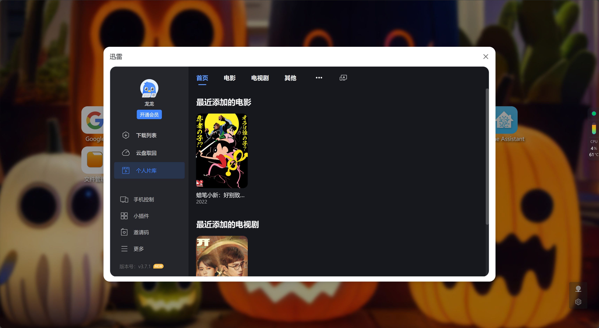

[中文](#中文) | [English](#english)

---

<div align=center>


</div>

---

# <a id="中文">中文</a>

# CDF-Panel（基于 Sun-Panel 二次开发）

> ⚠️ **声明**：本项目是基于开源项目 [Sun-Panel](https://github.com/hslr/sun-panel) 的二次开发版本，并非原版。我们对原项目进行了企业级功能增强与优化，但**代码全程由 AI 生成/修改**，可能存在较多未知 Bug，后续有时间会逐步完善。Production 环境使用请自行充分测试。

一个面向企业/团队的服务器、NAS 导航面板、浏览器首页（Homepage）。

---

## 🚨 与原版 Sun-Panel 的关系

| 项目 | CDF-Panel | Sun-Panel（原版） |
|------|-----------|-------------------|
| 开发方 | 二次开发（AI 驱动） | [hslr/sun-panel](https://github.com/hslr/sun-panel) |
| 定位 | 企业/团队使用 | 个人/NAS 使用 |
| 开发方式 | 全程 AI 辅助开发与修改 | 人工开发 |
| 稳定性 | ⚠️ 实验性，可能有未知 Bug | 社区验证，相对稳定 |
| Docker 镜像 | `cdf3275/cdf-panel` | `hslr/sun-panel` |
| License | MIT | MIT |

> 感谢原版 Sun-Panel 作者 [hslr](https://github.com/hslr) 的开源贡献 🙏

---

## 📖 项目简介

CDF-Panel 是基于 Sun-Panel 二次开发的自托管导航面板/浏览器主页，在保留原版全部功能的基础上，进行了面向企业场景的功能增强。主要用于 NAS、服务器和企业内部服务的统一入口管理。

### 🏢 企业场景增强

我们关注企业/团队使用场景，在以下方面做了增强：

- **更强 RBAC**：4 种角色、21 个权限模块、58 项细粒度权限，满足企业多层级管理需求
- **部门数据隔离**：按部门组织用户，实现数据访问隔离
- **审计日志**：完整记录登录日志、操作日志，满足企业合规需求
- **站内信系统**：定向通知 + 全员公告，企业内部信息传达更高效
- **定时任务提醒**：Cron 定时创建通知，适合定期巡检等场景
- **粘贴板密码保护**：支持阅后即焚与密码保护，敏感信息传输更安全
- **模块化配置**：按需启停功能模块，更灵活

### 典型使用场景

- 企业/团队内部服务统一导航入口
- 浏览器启动首页，快速访问常用系统
- 部署在 NAS/服务器上，作为所有自建服务的门户
- 团队共享：每个成员的常用网站集合在一个页面

---

## ✨ 主要功能

### 🏠 核心导航面板

| 功能 | 说明 |
|------|------|
| 应用图标导航 | 详情模式（大卡片）和图标模式（宫格小图标）|
| 图标分组管理 | 按类别分组，支持拖拽排序 |
| 内网/外网双地址 | 每个应用支持 LAN/WAN 双地址，一键切换 |
| 局域网自动探测 | 自动检测内网可达性，智能切换地址 |
| 三种打开方式 | 当前页跳转、新窗口、内置小窗口（iframe）|
| 右键菜单 | 快捷操作：新窗口、切换内外网、编辑、删除 |
| 实时搜索 | 首页搜索框快速过滤图标 |
| 壁纸背景 | 自定义背景，支持模糊和遮罩 |
| 网站图标自动抓取 | 输入 URL 自动获取 favicon |

### 📦 桌面模块

| 模块 | 说明 |
|------|------|
| 便签 | 可拖拽、可变大小和颜色，支持透明模式 |
| 系统监控 | CPU、内存、磁盘实时监控 |
| 搜索框 | 全局搜索入口 |
| 数字时钟 | 可显示/隐藏秒 |

### 👥 用户与权限（RBAC）

| 功能 | 说明 |
|------|------|
| 多用户管理 | 管理员 / 普通用户 / 部门管理员 |
| 角色权限系统 | 4 种角色，21 模块，58 项细粒度权限 |
| 部门管理 | 按部门隔离数据 |
| 公开访问模式 | 无需登录即可浏览（访客模式）|
| Token 认证 | 安全登录验证 |

### 🔧 系统管理

| 功能 | 说明 |
|------|------|
| 用户管理 | 创建、编辑、删除用户 |
| 角色权限 | 权限矩阵可视化配置 |
| 系统设置 | 站点名称、Logo、邮件 SMTP、登录页背景等 |
| 样式自定义 | 面板外观个性化定制 |
| 备份管理 | 数据备份与恢复 |
| 导入/导出 | JSON 格式数据迁移 |
| 文件管理 | 统一文件管理 |
| 图库管理 | 图片分类与图标库 |

### 📋 粘贴板

| 功能 | 说明 |
|------|------|
| 文本/文件中转 | 跨设备传输文本和文件 |
| 唯一 Code 分享 | 短码快速分享 |
| 阅后即焚 | 查看后自动销毁 |
| 过期时间 | 自定义有效期 |
| 密码保护 | 可设置访问密码 |

### 📢 通知系统

| 功能 | 说明 |
|------|------|
| 公告 | 全员可见 |
| 站内信 | 定向发送指定用户 |
| 多位置展示 | 登录页/首页展示 |

### ⏰ 定时任务

| 功能 | 说明 |
|------|------|
| Cron 定时提醒 | Cron 表达式，到时间自动通知 |
| 执行日志 | 任务执行记录 |

### 📊 系统监控与日志

| 功能 | 说明 |
|------|------|
| 实时监控 | CPU、内存、磁盘使用率 |
| 操作日志 | 完整管理操作记录 |
| 登录日志 | 登录成功/失败记录 |

### 🌍 国际化

- 中文简体
- English

---

## 🖼️ 预览截图

**多种风格，自由搭配**






**内置小窗口**




---

## 🚀 快速开始

### 默认账号密码

| 项目 | 值 |
|------|-----|
| 默认账号 | `admin` |
| 默认密码 | `12345678` |
| 默认端口 | `3030` |

> 首次启动自动创建管理员账号，登录后请立即修改密码。

### Docker 部署（推荐）

```bash
# 使用 CDF-Panel 镜像（二次开发版）
docker run -d --restart=always -p 3030:3030 \
  -v ~/docker_data/cdf-panel/conf:/app/conf \
  -v ~/docker_data/cdf-panel/uploads:/app/uploads \
  -v ~/docker_data/cdf-panel/database:/app/database \
  --name cdf-panel \
  cdf3275/cdf-panel:v1.2.0
```

```bash
# 或使用原版 Sun-Panel 镜像
docker run -d --restart=always -p 3030:3030 \
  -v ~/docker_data/sun-panel/conf:/app/conf \
  -v ~/docker_data/sun-panel/uploads:/app/uploads \
  -v ~/docker_data/sun-panel/database:/app/database \
  --name sun-panel \
  hslr/sun-panel
```

访问 `http://服务器IP:3030` 即可使用。

### 数据持久化目录

| 容器目录 | 说明 |
|----------|------|
| `/app/conf` | 配置文件 |
| `/app/uploads` | 上传的文件 |
| `/app/database` | SQLite 数据库文件 |
| `/app/runtime` | 运行日志（不推荐挂载）|

### 二进制运行

```bash
./sun-panel
```

### 开发模式

```bash
# 前端开发（端口 1002，代理到后端 3030）
pnpm install && pnpm dev

# 后端开发
cd service && go run main.go
```

---

## ⚙️ 命令行参数

| 参数 | 说明 |
|------|------|
| `-h` | 查看帮助 |
| `-config` | 生成配置文件 `conf/conf.ini` |
| `-password-reset` | 重置第一个管理员密码为 `12345678` |

---

## 📦 技术栈

| 层级 | 技术 | 说明 |
|------|------|------|
| 前端框架 | Vue 3 + TypeScript | 响应式 UI |
| 构建工具 | Vite 4 | 快速构建 |
| UI 组件库 | Naive UI 2 | 高质量 Vue 3 组件 |
| 样式 | Tailwind CSS 3 | 实用优先的 CSS |
| 拖拽 | vue-draggable-plus | 拖拽排序 |
| 国际化 | vue-i18n 9 | 中英文切换 |
| 后端框架 | Go + Gin | 高性能 HTTP |
| ORM | GORM | 数据库操作 |
| 默认数据库 | SQLite | 零配置开箱即用 |
| 可选数据库 | MySQL + Redis | 扩展支持 |
| 部署 | Docker | 多阶段构建，ARM 兼容 |

---

## 🗂️ 项目结构

```
sun-panel/
├── src/                    # 前端源码
│   ├── api/                #   API 请求
│   ├── components/         #   组件
│   │   ├── apps/           #     管理后台组件
│   │   ├── common/         #     通用组件
│   │   └── deskModule/     #     桌面模块
│   ├── views/              #   页面
│   ├── router/             #   路由
│   ├── store/              #   Pinia 状态管理
│   ├── locales/            #   国际化
│   ├── utils/              #   工具函数
│   └── main.ts             #   入口
├── service/                # 后端源码
│   ├── main.go             #   入口
│   ├── api/api_v1/         #   API 控制器
│   ├── models/             #   数据模型
│   ├── router/             #   路由注册
│   ├── initialize/         #   初始化
│   ├── global/             #   全局变量
│   └── lib/                #   工具库
├── config/                 # 配置目录
├── public/                 # 静态资源
├── Dockerfile              # Docker 构建文件
├── docker-compose.yml      # Docker Compose
├── build.sh                # 构建脚本
├── DEPLOYMENT.md           # 部署手册
└── UPDATELOG.md            # 更新日志
```

---

## 🔐 API 路由概览

### 面板 API (`/api/`)
`itemIcon` 图标 CRUD · `itemIconGroup` 分组 · `userConfig` 用户配置 · `stickyNote` 便签 · `pasteBin` 粘贴板 · `search` 搜索

### 系统管理 API (`/api/`)
`login/logout` 登录登出 · `user` 用户 · `role` 角色 · `permission` 权限 · `department` 部门 · `systemSetting` 系统设置 · `backup` 备份 · `file` 文件 · `icon` 图标 · `gallery` 图库 · `notice` 通知 · `job` 定时任务 · `log` 日志 · `monitor` 监控 · `importExport` 导入导出 · `moduleConfig` 模块配置 · `about` 关于

---

## ❓ 常见问题

### 忘记密码怎么办？

```bash
# Docker 容器内执行
docker exec cdf-panel ./sun-panel -password-reset

# 或二进制运行
./sun-panel -password-reset
```

### 如何备份数据？

后台 → 备份管理 → 创建备份。或手动备份 `database`、`conf`、`uploads` 目录。

### 如何配置 HTTPS？

推荐 Nginx 反向代理 + Let's Encrypt，详见 [DEPLOYMENT.md](./DEPLOYMENT.md)。

### 支持 ARM 吗？

支持。Docker 镜像支持 amd64 / arm64 / armv7。

---

## 🔗 相关链接

| 链接 | 说明 |
|------|------|
| [演示地址](https://960898.xyz) | CDF-Panel 在线演示 |
| [Docker Hub](https://hub.docker.com/r/cdf3275/cdf-panel) | CDF-Panel Docker 镜像 |
| [原版 Sun-Panel](https://github.com/hslr/sun-panel) | 上游开源项目 |
| [原版 Docker Hub](https://hub.docker.com/r/hslr/sun-panel) | 原版 Docker 镜像 |

---

## 📄 License

[MIT](./LICENSE) · 基于 [Sun-Panel](https://github.com/hslr/sun-panel) 二次开发

---

<br>
<br>

---

# <a id="english">English</a>

# CDF-Panel (Fork of Sun-Panel)

> ⚠️ **Disclaimer**: This project is a **fork / secondary development** based on the open-source [Sun-Panel](https://github.com/hslr/sun-panel), NOT the original version. We have enhanced it with enterprise-oriented features and optimizations. However, the **entire codebase has been developed and modified by AI**, which means there may be many unknown bugs. We will refine it over time as time permits. Please test thoroughly before using in production.

An enterprise / team-oriented server and NAS navigation panel, browser homepage.

---

## 🚨 Relationship with Original Sun-Panel

| | CDF-Panel | Sun-Panel (Original) |
|------|-----------|----------------------|
| Developer | Fork (AI-driven) | [hslr/sun-panel](https://github.com/hslr/sun-panel) |
| Target | Enterprise / Teams | Personal / NAS |
| Development | 100% AI-assisted development & modification | Manual development |
| Stability | ⚠️ Experimental, may have unknown bugs | Community-verified, relatively stable |
| Docker Image | `cdf3275/cdf-panel` | `hslr/sun-panel` |
| License | MIT | MIT |

> Huge thanks to the original Sun-Panel author [hslr](https://github.com/hslr) for the open-source contribution 🙏

---

## 📖 About

CDF-Panel is a fork of Sun-Panel — a self-hosted navigation panel & browser homepage. It retains all original features while adding enterprise-oriented enhancements. Ideal for managing unified access to NAS, servers, and internal enterprise services.

### 🏢 Enterprise Enhancements

We focus on enterprise/team scenarios with these enhancements:

- **Stronger RBAC**: 4 roles, 21 permission modules, 58 fine-grained permissions for multi-level enterprise management
- **Department Data Isolation**: Organize users by department with data access isolation
- **Audit Logging**: Complete login & operation logs for enterprise compliance
- **Internal Messaging**: Targeted notifications + public announcements for efficient internal communication
- **Cron Job Reminders**: Cron-based scheduled notifications, ideal for routine inspections
- **PasteBin Password Protection**: Burn-after-reading + password protection for secure information transfer
- **Modular Configuration**: Enable/disable feature modules on demand for maximum flexibility

### Use Cases

- Unified navigation portal for enterprise/team internal services
- Browser start page for quick access to frequently used systems
- Deploy on NAS/server as a portal for all self-hosted services
- Team sharing: centralized page for each member's frequently used sites

---

## ✨ Features

### 🏠 Core Navigation Panel

| Feature | Description |
|------|------|
| App Icon Navigation | Detail mode (large cards) + Icon mode (grid) |
| Icon Grouping | Group by category, drag-and-drop sorting |
| LAN/WAN Dual Address | Each app supports LAN & WAN addresses, one-click switch |
| Auto LAN Detection | Auto-detect internal network reachability |
| Three Open Modes | Current tab, new window, embedded iframe popup |
| Right-click Menu | Quick actions: new window, toggle LAN/WAN, edit, delete |
| Live Search | Quick icon filtering on homepage |
| Wallpaper | Custom background with blur and overlay effects |
| Auto Favicon | Auto-fetch favicon from URL |

### 📦 Desktop Modules

| Module | Description |
|------|------|
| Sticky Notes | Draggable, resizable, colorable, supports transparency |
| System Monitor | Real-time CPU, memory, disk monitoring |
| Search Box | Global search |
| Clock | Desktop clock with toggleable seconds |

### 👥 Users & RBAC

| Feature | Description |
|------|------|
| Multi-user | Admin / Regular User / Department Admin |
| Role-based Access | 4 roles, 21 modules, 58 permissions |
| Departments | Department-based data isolation |
| Public Access | Browse without login (guest mode) |
| Token Auth | Secure authentication |

### 🔧 System Management

| Feature | Description |
|------|------|
| User Management | Create, edit, delete users |
| Role Permissions | Visual permission matrix |
| System Settings | Site name, logo, SMTP, login background, etc. |
| Custom Styles | Panel appearance customization |
| Backup Management | Data backup & restore |
| Import/Export | JSON format data migration |
| File Management | Unified file management |
| Gallery Management | Image categorization & icon library |

### 📋 PasteBin

| Feature | Description |
|------|------|
| Text/File Transfer | Cross-device text and file sharing |
| Unique Code Sharing | Quick share via short code |
| Burn After Reading | Auto-destroy after viewing |
| Expiration | Custom content expiry |
| Password Protection | Optional access password |

### 📢 Notifications

| Feature | Description |
|------|------|
| Announcements | Visible to all users |
| Internal Messages | Targeted delivery to specific users |
| Multi-location Display | Login page / homepage |

### ⏰ Cron Jobs

| Feature | Description |
|------|------|
| Cron Reminders | Custom cron expressions, auto-create notifications |
| Execution Logs | Job execution tracking |

### 📊 Monitoring & Logs

| Feature | Description |
|------|------|
| Real-time Monitor | CPU, memory, disk usage |
| Operation Logs | Complete admin operation records |
| Login Logs | Login success/failure tracking |

### 🌍 i18n

- 中文简体
- English

---

## 🖼️ Screenshots

**Multiple styles**


**Embedded popup window**


---

## 🚀 Quick Start

### Default Credentials

| Item | Value |
|------|-------|
| Default Username | `admin` |
| Default Password | `12345678` |
| Default Port | `3030` |

> An admin account is auto-created on first start. Change the password immediately after login.

### Docker Deployment (Recommended)

```bash
# CDF-Panel image (forked version)
docker run -d --restart=always -p 3030:3030 \
  -v ~/docker_data/cdf-panel/conf:/app/conf \
  -v ~/docker_data/cdf-panel/uploads:/app/uploads \
  -v ~/docker_data/cdf-panel/database:/app/database \
  --name cdf-panel \
  cdf3275/cdf-panel:v1.2.0
```

```bash
# Or original Sun-Panel image
docker run -d --restart=always -p 3030:3030 \
  -v ~/docker_data/sun-panel/conf:/app/conf \
  -v ~/docker_data/sun-panel/uploads:/app/uploads \
  -v ~/docker_data/sun-panel/database:/app/database \
  --name sun-panel \
  hslr/sun-panel
```

Visit `http://server-ip:3030`.

### Persistent Directories

| Container Dir | Description |
|----------|------|
| `/app/conf` | Configuration files |
| `/app/uploads` | Uploaded files |
| `/app/database` | SQLite database |
| `/app/runtime` | Runtime logs (not recommended to mount) |

### Binary

```bash
./sun-panel
```

### Development

```bash
# Frontend dev (port 1002, proxy to backend 3030)
pnpm install && pnpm dev

# Backend dev
cd service && go run main.go
```

---

## ⚙️ CLI Arguments

| Argument | Description |
|------|------|
| `-h` | Show help |
| `-config` | Generate config file `conf/conf.ini` |
| `-password-reset` | Reset first admin password to `12345678` |

---

## 📦 Tech Stack

| Layer | Tech | Notes |
|------|------|------|
| Frontend | Vue 3 + TypeScript | Reactive UI |
| Bundler | Vite 4 | Fast builds |
| UI Library | Naive UI 2 | High-quality Vue 3 components |
| CSS | Tailwind CSS 3 | Utility-first |
| Drag & Drop | vue-draggable-plus | Sortable |
| i18n | vue-i18n 9 | Chinese / English |
| Backend | Go + Gin | High-performance HTTP |
| ORM | GORM | Database operations |
| Default DB | SQLite | Zero-config, ready out of the box |
| Optional DB | MySQL + Redis | Extended support |
| Deploy | Docker | Multi-stage build, ARM compatible |

---

## 🗂️ Project Structure

```
sun-panel/
├── src/                    # Frontend source
│   ├── api/                #   API requests
│   ├── components/         #   Components
│   ├── views/              #   Pages
│   ├── router/             #   Router
│   ├── store/              #   Pinia state
│   ├── locales/            #   i18n
│   └── main.ts             #   Entry
├── service/                # Backend source
│   ├── main.go             #   Entry
│   ├── api/api_v1/         #   API controllers
│   ├── models/             #   Data models
│   ├── router/             #   Route registration
│   └── lib/                #   Utilities
├── Dockerfile              # Docker build
├── docker-compose.yml      # Docker Compose
└── DEPLOYMENT.md           # Deployment guide
```

---

## ❓ FAQ

### Forgot password?

```bash
docker exec cdf-panel ./sun-panel -password-reset
```

### How to backup?

Admin panel → Backup Management → Create Backup. Or manually backup `database`, `conf`, `uploads`.

### HTTPS?

Nginx reverse proxy + Let's Encrypt recommended. See [DEPLOYMENT.md](./DEPLOYMENT.md).

### ARM support?

Yes. Docker image supports amd64 / arm64 / armv7.

---

## 🔗 Links

| Link | Description |
|------|------|
| [Demo](https://960898.xyz) | CDF-Panel online demo |
| [Docker Hub](https://hub.docker.com/r/cdf3275/cdf-panel) | CDF-Panel Docker image |
| [Original Sun-Panel](https://github.com/hslr/sun-panel) | Upstream open-source project |
| [Original Docker Hub](https://hub.docker.com/r/hslr/sun-panel) | Original Docker image |

---

## 📄 License

[MIT](./LICENSE) · Forked from [Sun-Panel](https://github.com/hslr/sun-panel)
